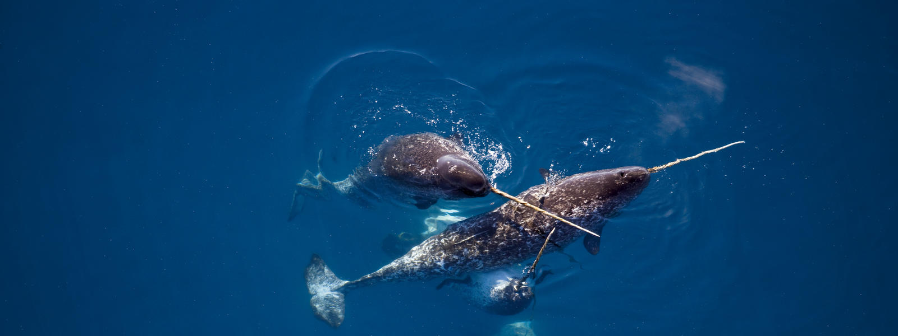

# Sarah Smith

My resume.

## Picture

Narwhals - hang out in the Arctic, prefer deep dives (up to 1500m!) over shallow exploration. 

Credit: <a href="https://www.worldwildlife.org/species/narwhal">World Wildlife Fund</a>

## Education

<a href= "https://www1.lehigh.edu/">Lehigh University</a> - BA (2012)

<a href="https://climatesociety.ei.columbia.edu/">Columbia University</a> - MA (2018)

<a href="https://eesc.columbia.edu/content/graduate-program-0">Columbia University</a> - PhD (2025)

## Research Interests

Northern hemisphere chemical transport paths, aerosols, remote sensing, polar cell atmospheric dynamics, climate (change) in the Arctic. 